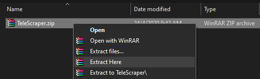
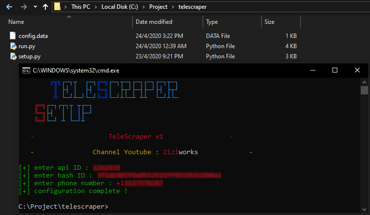

# TeleScraper by [Ziziworks](https://www.youtube.com/channel/UCW36UNroi3B4Ix9ln1e6rUQ?sub_confirmation=1)

[Youtube](https://www.youtube.com/channel/UCW36UNroi3B4Ix9ln1e6rUQ?sub_confirmation=1) |
[Instagram](https://www.instagram.com/ziziworks/) |
[Facebook](https://www.facebook.com/ziziworks/) |
[Telegram Channel](https://t.me/ziziworks) |
[Telegram Group](https://t.me/ziziworksgroup) |
[Twitter](https://twitter.com/ziziworks_MY)  

[](https://forthebadge.com)    [](https://forthebadge.com)

A script written on Python for scraping username, phone on telegram.  
It can be used for telegram blasting or inviting members to your group using [TeleInviter](https://github.com/ziziwho/teleinviter).  
This script can be run on Window's command prompt
and Termux terminal on Android.

## Overview
A few months ago [Ziziwho](https://github.com/ziziwho/) created [TeleInviter](https://github.com/ziziwho/teleinviter), a script to automatically invite members to the telegram groups but did not disclose how zizi was scraping the usernames on the telegram. So zizi has created a [TeleScraper](https://github.com/ziziwho/telescraper) to do that. [TeleScraper](https://github.com/ziziwho/telescraper) is a script where it is used to extract the usernames from groups on a telegram.

    
This is a script that was run in cmd
### Features:
- [x] Loginable even with 2FA enabled
- [x] Scrap username, phone and group title.
- [x] Easy setup.py installation.
- [x] Easy to configure API ID & API HASH.
- [ ] Merge .csv file
- [ ] Update script 
### Result:
   
This is an example of scrapped usernames.
## Download
Script is where the magic begins. Go ahead and download it now.    
If you don't download the script yet get it now by clicking [/releases](https://github.com/ziziwho/telescraper//releases)
## Intallation

### Obtaining api id
You can obtain your own API ID at https://core.telegram.org/api/obtaining_api_id#obtaining-api-id    
Do not skip this step ❗ This step is very important and crucial for the next step.   

### For Windows

<details><summary>Click to expand!</summary>
<p>
1. Extract TeleScraper.zip    

    

2. Open your windows command prompt or termux terminal.    

⚠️ `../your_path/` mean path/directory/location to your TeleInviter file.    

Type the following command:    
`python C:\Project\telescraper\setup.py -h`    

3. Your command prompt should look like this:    

    

4. To configure *config.data*, Type the following command:    
`python C:\Project\telescraper\setup.py -c`    

    
⚠️ You can always re-run these steps (step 4) to reconfigure.    

5. To install requirements, type the following command:    
`python C:\Project\telescraper\setup.py -i`    

⚠️ This may take a while depending on your connection speed.    

6. Installation finished. To run the TeleScraper, type the following command:    
`python C:\Project\telescraper\run.py`    

Watch video tutorial :    

[](/)    
</p>
</details>
### For Android
<details><summary>Click to expand!</summary>
<p>
⚠️ Installation for android is quite same as it is for Windows.
`python /storage/emulated/0/telescraper/setup.py -h`

Watch video tutorial :    

[](/)    
</p>
</details>

##### Usage: 
> python run.py

❗ You must run setup.py before run.py for configurations.

Open your windows command prompt or termux terminal. Type the following command:    

> **Windows@Command-Prompt :**    
> ```
> python C:\Project\telescraper\run.py
> ```
> **Android@Termux :**    
> ```
> python /storage/emulated/0/telescraper/run.py
> ```
⚠️ Attention! Make sure you enter your phone number which linked with telegram.
## Bugs and Issues

Have a bug or an issue with this script? [Open a new issue](https://github.com/ziziwho/telescraper/issues/new) here on GitHub or leave a message on my [telegram](http://t.me/ziziwho).


---

> **Disclaimer**<a name="disclaimer" />: Please be note that this is a learning project for me. I am by no means responsible for any usage of this tool. Use on your own behalf. I'm also not responsible if your accounts get any punishment due to extensive use of this script. Your Telegram account may get banned therefore, I am not responsible for any improper use of this bot. This bot is intended for the purpose of automating Click Bot, as well as efficiently managing bot command. You ended up spamming groups join, telegram request getting reported left and right, and you ended up in a Finale Battle with Telegram and at the end. Telegram Team deleted your account?
And after that, then you pointed your fingers at us, for getting your account deleted? I will rolling on the floor laughing at you.
